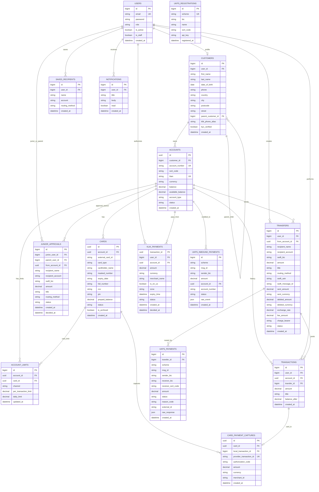
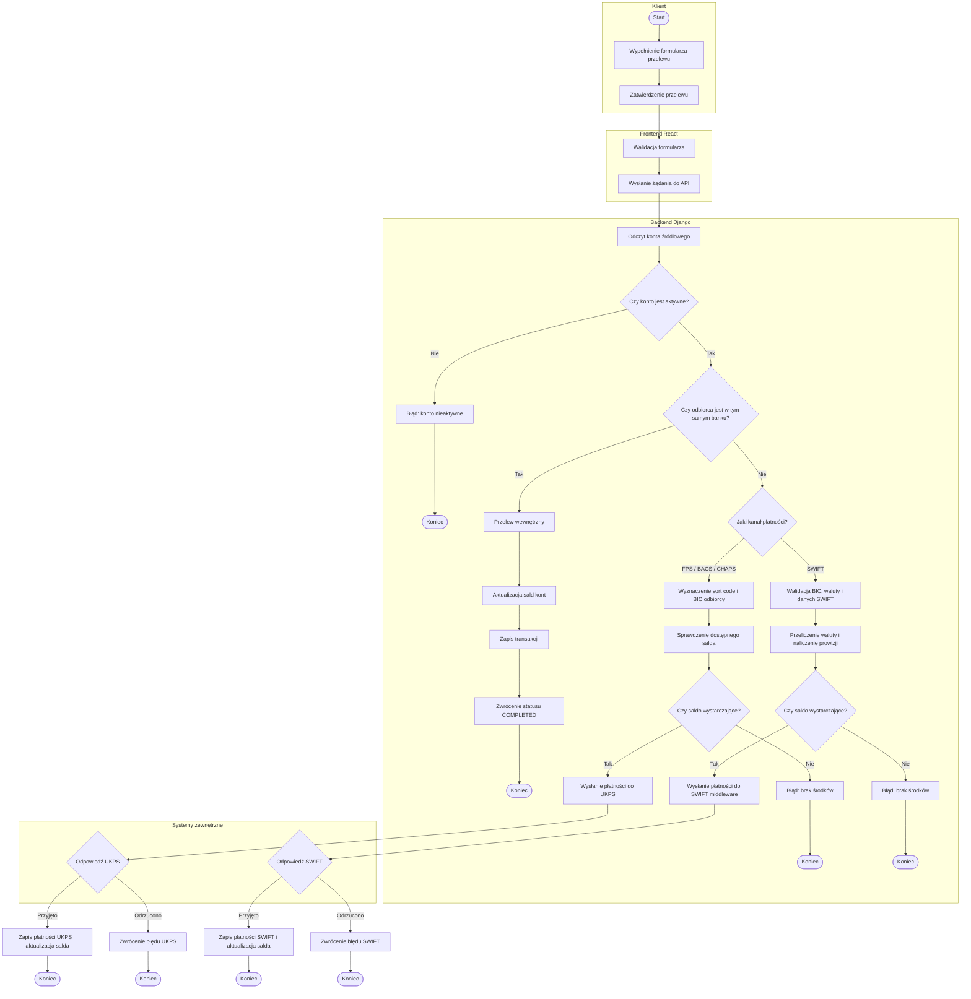

# UK Bank System — Aplikacje Biznesowe

Aplikacja bankowa symulująca brytyjski bank komercyjny. System składa się z backendu Django REST Framework, frontendu React/Vite oraz bazy PostgreSQL. Projekt integruje się z zewnętrznymi systemami płatniczymi i usługami pomocniczymi: UK Payment Systems dla CHAPS/FPS/BACS, SWIFT middleware dla przelewów międzynarodowych, KLIK/BLIK-like payments oraz zewnętrznym providerem kart płatniczych.

Projekt został przygotowany jako środowisko demonstracyjne/edukacyjne. Nie jest systemem produkcyjnym i zawiera uproszczenia celowo przyjęte na potrzeby projektu uczelnianego, np. stałe kursy walut SWIFT, testowe klucze API oraz uproszczone rozliczanie części płatności.

---

## Spis treści

1. [Zakres funkcjonalny](#1-zakres-funkcjonalny)
2. [Architektura projektu](#2-architektura-projektu)
3. [Uruchomienie projektu](#3-uruchomienie-projektu)
4. [Adresy usług i dane dostępowe](#4-adresy-usług-i-dane-dostępowe)
5. [Konfiguracja `.env`](#5-konfiguracja-env)
6. [Baza danych i diagram Mermaid](#6-baza-danych-i-diagram-mermaid)
7. [Logika biznesowa](#7-logika-biznesowa)
8. [Diagram BPMN — proces obsługi przelewu](#8-diagram-bpmn--proces-obsługi-przelewu)
9. [Integracje zewnętrzne](#9-integracje-zewnętrzne)
10. [Najważniejsze endpointy API](#10-najważniejsze-endpointy-api)
11. [Komendy administracyjne Django](#11-komendy-administracyjne-django)
12. [Frontend i widoki aplikacji](#12-frontend-i-widoki-aplikacji)
13. [Typowe problemy i rozwiązania](#13-typowe-problemy-i-rozwiązania)
14. [Przykładowe scenariusze testowe](#14-przykładowe-scenariusze-testowe)
15. [Status projektu](#15-status-projektu)

---

## 1. Zakres funkcjonalny

System obsługuje następujące obszary:

### Rachunki i klienci

- rejestracja użytkownika,
- logowanie JWT,
- konfiguracja profilu klienta,
- rachunek główny klienta,
- konto junior przypisane do konta rodzica,
- wpłata środków testowych na rachunek,
- rozróżnienie salda księgowego `balance` i dostępnego `available_balance`.

### Przelewy

- przelew własny między rachunkami użytkownika,
- przelew wewnętrzny do rachunku istniejącego w tym samym banku,
- przelew zewnętrzny UK przez UKPS:
  - FPS,
  - BACS,
  - CHAPS,
- przelew międzynarodowy SWIFT,
- zapis historii przelewów,
- zapis odbiorców,
- obsługa akceptacji przelewów dla kont junior.

### Karty płatnicze

- tworzenie kart:
  - `VIRTUAL`,
  - `PHYSICAL`,
  - `PREPAID`,
- synchronizacja statusu z providerem kart,
- zamrożenie i odmrożenie karty,
- aktywacja karty,
- doładowanie karty prepaid,
- archiwizacja/usunięcie karty z aplikacji,
- callback płatności kartą z zewnętrznego providera.

### Limity

Limity zostały wydzielone do osobnej zakładki `Limits`.

Obsługiwane są wyłącznie:

- limit konkretnej karty,
- limit KLIK/BLIK code payment,
- limit KLIK/BLIK phone transfer.

Dla każdego limitu dostępne są dwa pola:

- `per_transaction_limit` — limit pojedynczej transakcji,
- `daily_limit` — limit dzienny.

W projekcie nie są używane limity przelewów FPS/BACS/CHAPS/SWIFT.

### KLIK/BLIK-like payments

- generowanie kodu płatniczego,
- odbiór webhooka autoryzacyjnego,
- akceptacja lub odrzucenie płatności,
- rejestracja aliasu telefonu,
- przelew P2P po numerze telefonu.

### Powiadomienia

- lista powiadomień użytkownika,
- oznaczanie jednego lub wszystkich powiadomień jako przeczytane,
- powiadomienia o przelewach, KLIK, kartach i kontach junior.

---

## 2. Architektura projektu

| Warstwa | Technologia | Opis |
|---|---|---|
| Frontend | React + Vite + TypeScript + TailwindCSS | Interfejs użytkownika banku |
| Backend | Django + Django REST Framework | API bankowe, logika biznesowa, integracje |
| Baza danych | PostgreSQL 17 | Dane użytkowników, rachunków, kart, przelewów i limitów |
| Autoryzacja | JWT | Logowanie i autoryzacja zapytań API |
| Dokumentacja API | drf-spectacular + Swagger UI | Dostępna pod `/api/docs/` |
| Konteneryzacja | Docker Compose | Uruchomienie całego projektu |
| Integracja kart | REST + HMAC/API key | Komunikacja z zewnętrznym providerem kart |
| Integracja UKPS | REST + SSE listener | CHAPS/FPS/BACS, auto-rejestracja i odbiór eventów |
| Integracja SWIFT | OAuth/client credentials + REST | Przelewy międzynarodowe |
| Integracja KLIK | REST + webhook | Kody, alias telefonu i P2P |

### Główne aplikacje backendu

| Aplikacja Django | Odpowiedzialność |
|---|---|
| `users` | użytkownicy, logowanie, admin |
| `customers` | profil klienta i dane osobowe |
| `accounts` | rachunki, wpłaty, konto junior, limity |
| `transactions` | historia operacji i analytics |
| `transfers` | przelewy własne, zewnętrzne, SWIFT, junior approvals |
| `cards` | karty i callback płatności kartą |
| `limits` | limity kart i KLIK/BLIK |
| `klik` | płatności KLIK/BLIK-like |
| `ukps` | integracja CHAPS/FPS/BACS |
| `notifications` | powiadomienia użytkownika |

---

## 3. Uruchomienie projektu

### 3.1 Wymagania

Do uruchomienia projektu potrzebne są:

- Docker Desktop,
- Docker Compose,
- wolne porty:
  - `5173` — frontend,
  - `8001` — backend Django,
  - `5532` — PostgreSQL na hoście,
- zewnętrzna sieć Docker `cards-backend`, ponieważ bank komunikuje się z systemem kart przez osobną sieć.

### 3.2 Przygotowanie pliku `.env`

Skopiuj plik `.env.example` do `.env`:

```bash
cp .env.example .env
```

Na Windows PowerShell:

```powershell
Copy-Item .env.example .env
```

Następnie sprawdź wartości w `.env`, szczególnie:

- dane Postgresa,
- `VITE_API_URL`,
- klucze KLIK,
- klucze systemu kart,
- adresy UKPS,
- dane SWIFT.

### 3.3 Utworzenie sieci dla systemu kart

Jeżeli sieć jeszcze nie istnieje:

```bash
docker network create cards-backend
```

Jeżeli sieć już istnieje, Docker zwróci informację, że taka sieć jest już dostępna — to nie jest błąd.

### 3.4 Uruchomienie banku

```bash
docker compose up --build
```

Po starcie wykonywane są automatycznie:

1. start kontenera PostgreSQL,
2. sprawdzenie gotowości bazy przez `healthcheck`,
3. migracje Django:
   ```bash
   python manage.py migrate --noinput
   ```
4. utworzenie lub aktualizacja administratora Django:
   ```bash
   python manage.py ensure_admin
   ```
5. start backendu na porcie kontenerowym `8000`, wystawionym na hoście jako `8001`,
6. start frontendu na porcie `5173`,
7. start `ukps-listener`, który:
   - czeka na migracje,
   - czeka aż UKPS będzie dostępny,
   - rejestruje bank w CHAPS/FPS/BACS,
   - wypisuje aktualne klucze,
   - uruchamia nasłuchiwanie eventów.

### 3.5 Uruchamianie z pełnymi integracjami

Dla pełnego scenariusza integracyjnego warto uruchomić również projekty zewnętrzne:

| System zewnętrzny | Domyślny adres używany przez bank |
|---|---|
| KLIK payments | `http://host.docker.internal:8000/api/v1` |
| Card gateway/provider | `http://host.docker.internal:8072` |
| UKPS CHAPS | `http://host.docker.internal:8420` |
| UKPS FPS | `http://host.docker.internal:8421` |
| UKPS BACS | `http://host.docker.internal:8422` |
| SWIFT middleware | `http://host.docker.internal:3000` |

Bank może wystartować bez UKPS, ale `ukps-listener` będzie czekał na dostępność usług CHAPS/FPS/BACS.

---

## 4. Adresy usług i dane dostępowe

Po uruchomieniu projektu:

| Usługa | Adres |
|---|---|
| Frontend banku | `http://localhost:5173` |
| Backend API | `http://localhost:8001/api/` |
| Django admin | `http://localhost:8001/admin/` |
| Swagger UI | `http://localhost:8001/api/docs/` |
| OpenAPI schema | `http://localhost:8001/api/schema/` |
| Callback płatności kartą | `http://localhost:8001/capture` |
| KLIK authorize webhook | `http://localhost:8001/api/klik/webhook/authorize` |
| PostgreSQL na hoście | `localhost:5532` |

### Domyślny administrator Django

Administrator tworzony jest automatycznie przez komendę `ensure_admin`.

Domyślne dane z `.env.example`:

| Pole | Wartość |
|---|---|
| E-mail | `admin@test.com` |
| Hasło | `admin123` |

Jeżeli administrator już istnieje, nie jest tworzony drugi raz. Hasło jest resetowane tylko wtedy, gdy w `.env` ustawiono:

```env
DJANGO_SUPERUSER_RESET_PASSWORD=True
```


### Dane testowe z seedera `seed_demo`

Projekt posiada komendę seedującą dane demonstracyjne:

```bash
docker compose exec backend python manage.py seed_demo
```

Jeżeli baza ma zostać wyczyszczona z poprzednich danych demo i odtworzona od początku:

```bash
docker compose exec backend python manage.py seed_demo --reset
```

Seeder tworzy minimalny, sensowny zestaw danych do testowania aplikacji:

- jedno konto główne rodzica,
- jedno konto junior przypisane do rodzica,
- jednego lokalnego odbiorcę w tym samym banku,
- przykładową historię transakcji,
- zapisanych odbiorców do testów przelewów lokalnych, FPS/BACS oraz SWIFT,
- limity KLIK/BLIK dla kont.


#### Użytkownicy testowi

| Rola | E-mail | Hasło | Zastosowanie |
|---|---|---|---|
| Rodzic / klient główny | `demo.parent@ukbank.test` | `demo123` | Główne konto testowe, przelewy, KLIK, konto junior |
| Junior | `demo.junior@ukbank.test` | `demo123` | Logowanie jako dziecko i test konta junior |
| Lokalny odbiorca | `demo.receiver@ukbank.test` | `demo123` | Odbiorca do testów przelewów wewnętrznych |

#### Rachunki testowe

| Użytkownik | Typ konta | IBAN | Sort code | Numer konta | Saldo startowe |
|---|---|---|---|---|---:|
| `demo.parent@ukbank.test` | `CURRENT` | `GB89LYOB10203000000001` | `10-20-30` | `00000001` | `£4872.50` |
| `demo.receiver@ukbank.test` | `CURRENT` | `GB89LYOB10203000000002` | `10-20-30` | `00000002` | `£1400.00` |
| `demo.junior@ukbank.test` | `JUNIOR` | `GB89LYOB10203000000003` | `10-20-30` | `00000003` | `£150.00` |

#### Przykładowe dane do testów przelewów

| Typ testu | Dane |
|---|---|
| Przelew wewnętrzny | odbiorca: `demo.receiver@ukbank.test`, IBAN: `GB89LYOB10203000000002` |
| FPS | odbiorca zewnętrzny: `GB00BARC20000012345678`, routing: `FPS` |
| BACS | odbiorca zewnętrzny: `GB00HSBC40000012345678`, routing: `BACS` |
| CHAPS | odbiorca zewnętrzny: `GB00LLOY30000012345678`, routing: `CHAPS` |
| SWIFT | rachunek: `US123456789012345678901234`, BIC: `USBKUS01XXX`, waluta: `USD`, charge bearer: `SHA` |


---

## 5. Konfiguracja `.env`

Przykładowy plik `.env.example` powinien zawierać:

```env
# PostgreSQL
POSTGRES_DB=uk_bank
POSTGRES_USER=bank_admin
POSTGRES_PASSWORD=twoje_haslo
POSTGRES_HOST_PORT=5532

# Auto-created Django admin user
DJANGO_SUPERUSER_EMAIL=admin@test.com
DJANGO_SUPERUSER_PASSWORD=admin123
DJANGO_SUPERUSER_RESET_PASSWORD=False

# Frontend
VITE_API_URL=http://localhost:8001/api

# KLIK payments
KLIK_BASE_URL=http://host.docker.internal:8000/api/v1
KLIK_BANK_API_KEY=
KLIK_ZONE=UK

# Card gateway
CARD_GATEWAY_BASE_URL=http://host.docker.internal:8072
CARD_GATEWAY_API_KEY=bank-key-uk-a
CARD_GATEWAY_HMAC_SECRET=secret-uk-a-hmac

# UK Payment Systems: CHAPS / FPS / BACS
UKPS_CHAPS_URL=http://host.docker.internal:8420
UKPS_FPS_URL=http://host.docker.internal:8421
UKPS_BACS_URL=http://host.docker.internal:8422
UKPS_BANK_BIC=LYOBGB2L
UKPS_BANK_NAME=Lyo Bank
UKPS_BANK_SORT_CODE=10-20-30
UKPS_BANK_SU_CODE=SU-LYOB
UKPS_AUTO_REGISTER=True
UKPS_INBOUND_FALLBACK_ACCOUNT=

# Optional UKPS API keys, used when bank database was cleaned but UKPS still has participant
UKPS_CHAPS_API_KEY=
UKPS_FPS_API_KEY=
UKPS_BACS_API_KEY=

# Recipient-bank directory for UKPS routing by UK sort code
UKPS_BIC_SORT_200000=BARCGB2L
UKPS_BIC_SORT_400000=HSBCGB44
UKPS_BIC_SORT_300000=LLOYGB21
UKPS_BIC_SORT_600000=SNDRUK22

# SWIFT middleware — outgoing international transfers
SWIFT_BASE_URL=http://host.docker.internal:3000
SWIFT_CLIENT_ID=bank-ukbkgb01
SWIFT_CLIENT_SECRET=secret-ukbkgb01
SWIFT_BANK_BIC=UKBKGB01XXX
SWIFT_BANK_NAME=Lyo Bank
SWIFT_AUTO_SEND=True

# Fixed FX rates used by the bank
SWIFT_RATE_GBP_USD=1.25
SWIFT_RATE_GBP_EUR=1.15
SWIFT_RATE_GBP_PLN=5.00

# Local SWIFT fees charged by the bank in GBP
SWIFT_FEE_OUR_GBP=15.00
SWIFT_FEE_SHA_GBP=5.00
SWIFT_FEE_BEN_GBP=0.00
```

### Ważne uwagi konfiguracyjne

- `VITE_API_URL` musi wskazywać na backend z perspektywy przeglądarki, czyli domyślnie `http://localhost:8001/api`.
- Postgres wewnątrz kontenera działa na porcie `5432`, ale na komputerze jest wystawiony jako `5532`.
- pgAdmin został usunięty z projektu, więc zmienne `PGADMIN_EMAIL` i `PGADMIN_PASSWORD` nie są potrzebne.
- `UKPS_*_API_KEY` mogą być puste, jeśli `UKPS_AUTO_REGISTER=True` i baza UKPS jest czysta.
- Jeżeli wyczyszczono bazę banku przez `docker compose down -v`, ale nie wyczyszczono UKPS, można wkleić istniejące klucze API do `.env`, żeby bank odtworzył rejestrację lokalnie bez ponownego tworzenia uczestnika.

---

## 6. Baza danych i diagram Mermaid

Poniższy diagram pokazuje najważniejsze tabele aktualnej wersji projektu.



### Najważniejsze relacje

- `User` posiada profil `Customer`.
- `Customer` posiada rachunki `Account`.
- Konto junior jest reprezentowane przez `Customer.parent_customer`.
- `Account` posiada historię `Transaction`.
- `Transfer` opisuje przelew wychodzący i może mieć powiązanie z `UKPSPayment`.
- `Card` jest przypisana do konkretnego konta.
- `AccountLimits` przechowuje limity KLIK/BLIK oraz limity konkretnych kart.
- `KlikPayment` reprezentuje płatność oczekującą na akceptację klienta.
- `UKPSRegistration` przechowuje API key banku dla CHAPS/FPS/BACS.

---

## 7. Logika biznesowa

### 7.1 Rachunki i saldo

System używa dwóch pól salda:

- `balance` — saldo księgowe,
- `available_balance` — środki dostępne dla użytkownika.

W większości operacji środki są sprawdzane względem `available_balance`.

### 7.2 Routing przelewów

Logika przelewów jest obsługiwana przez `NationalTransferView` oraz `_route_external()`.

Podział:

| Przypadek | Obsługa |
|---|---|
| Odbiorca istnieje w bazie banku | przelew wewnętrzny |
| Odbiorca ma zewnętrzny brytyjski IBAN | UKPS: FPS/BACS/CHAPS |
| Odbiorca zagraniczny lub routing `SWIFT` | SWIFT middleware |
| Konto junior | tworzone jest `JuniorApproval` do decyzji rodzica |

### 7.3 FPS/BACS/CHAPS

Dla przelewów UK użytkownik nie musi wpisywać BIC. Bank rozpoznaje bank odbiorcy po sort code wyciągniętym z IBAN-u.

Przykłady obsługiwanych sort code:

| Sort code | BIC |
|---|---|
| `20-00-00` | `BARCGB2L` |
| `40-00-00` | `HSBCGB44` |
| `30-00-00` | `LLOYGB21` |
| `60-00-00` | `SNDRUK22` |

Przykładowy IBAN testowy:

```text
GB00BARC20000012345678
```

Bank odczytuje z niego:

```text
sort code: 20-00-00
account number: 12345678
receiver BIC: BARCGB2L
```

### 7.4 SWIFT

SWIFT jest obsługiwany jako przelew międzynarodowy. Użytkownik podaje:

- rachunek odbiorcy,
- BIC/SWIFT banku odbiorcy,
- walutę przelewu,
- kwotę,
- opcję kosztów: `OUR`, `SHA`, `BEN`.

Bank nalicza stały kurs FX i opłatę lokalną w GBP.

Przykład:

- 100 USD,
- charge bearer `SHA`,
- kurs GBP/USD = 1.25,
- fee SHA = 5 GBP,
- debit = 100 / 1.25 + 5 = 85 GBP.

### 7.5 Karty

Karty są tworzone w zewnętrznym providerze. Lokalnie bank zapisuje:

- token zewnętrzny karty,
- typ karty,
- maskowany numer,
- status,
- dane podglądowe do demonstracji,
- saldo prepaid dla kart prepaid.

Dla kont junior wymuszany jest typ `PREPAID`, a konto junior może mieć jedną aktywną kartę prepaid.

### 7.6 Limity

Limity są w osobnej zakładce `Limits`.

Obsługiwane kanały:

| Kanał | Zakres |
|---|---|
| `CARD` | limit konkretnej karty, rozróżniany przez `card_id` |
| `BLIK` | limit kodu KLIK/BLIK |
| `BLIK_PHONE` | limit przelewu KLIK/BLIK na numer telefonu |

Dla każdego kanału istnieją tylko dwa limity:

- dzienny,
- pojedynczej transakcji.

Nie ma limitów przelewów FPS/BACS/CHAPS/SWIFT.

---

## 8. Diagram BPMN — proces obsługi przelewu

Poniższy diagram przedstawia uproszczony proces biznesowy realizacji przelewu w systemie UK Bank. Diagram został przygotowany w formie BPMN-like z podziałem na główne role procesu: klient, frontend, backend banku oraz systemy zewnętrzne. Pokazuje moment walidacji danych, wybór ścieżki przelewu oraz obsługę odpowiedzi z UKPS lub SWIFT.



Diagram pokazuje, że przelew wewnętrzny jest realizowany bez systemów zewnętrznych, przelewy krajowe UK są kierowane przez UKPS, a przelewy zagraniczne przez SWIFT. Dzięki temu backend nie traktuje wszystkich płatności jednakowo — sposób obsługi zależy od rachunku odbiorcy oraz wybranego kanału routingu.

---

## 9. Integracje zewnętrzne

### 9.1 UK Payment Systems — CHAPS/FPS/BACS

Bank integruje się z trzema usługami UKPS:

| System | Port | Opis |
|---|---:|---|
| CHAPS | `8420` | RTGS, wysokokwotowy przelew GBP |
| FPS | `8421` | szybki przelew GBP |
| BACS | `8422` | przelew paczkowy/cykliczny, Standard 18 |

Bank posiada własną tożsamość:

```env
UKPS_BANK_BIC=LYOBGB2L
UKPS_BANK_SORT_CODE=10-20-30
UKPS_BANK_NAME=Lyo Bank
UKPS_BANK_SU_CODE=SU-LYOB
```

`ukps-listener` przy starcie:

1. czeka na migracje,
2. czeka aż CHAPS/FPS/BACS odpowiedzą,
3. wywołuje `ukps_register`,
4. wypisuje `ukps_keys`,
5. uruchamia listener SSE.

Dzięki temu bank sam rejestruje się w zewnętrznym systemie płatniczym.

### 9.2 Problem ponownej rejestracji UKPS

Jeżeli wyczyszczono bazę banku przez:

```bash
docker compose down -v
```

a baza UKPS nadal istnieje, bank nie pamięta już API key, ale UKPS pamięta uczestnika `LYOBGB2L`. Wtedy ponowna rejestracja może zwrócić błąd `500 Failed to create participant`.

Rozwiązania:

1. wyczyścić również bazę UKPS,
2. albo wkleić istniejące API key do `.env`:

```env
UKPS_CHAPS_API_KEY=...
UKPS_FPS_API_KEY=...
UKPS_BACS_API_KEY=...
```

Bank potrafi wtedy odtworzyć lokalne wpisy `UKPSRegistration` na podstawie `.env`.

### 9.3 SWIFT middleware

Bank działa jako istniejący uczestnik SWIFT:

```env
SWIFT_CLIENT_ID=bank-ukbkgb01
SWIFT_CLIENT_SECRET=secret-ukbkgb01
SWIFT_BANK_BIC=UKBKGB01XXX
```

Obsługiwane jest wysyłanie przelewów wychodzących. Odbiór przelewów SWIFT nie jest realizowany bezpośrednio przez Django, ponieważ zewnętrzny middleware ma statycznie skonfigurowane mock banki.

### 9.4 Card gateway/provider

Konfiguracja:

```env
CARD_GATEWAY_BASE_URL=http://host.docker.internal:8072
CARD_GATEWAY_API_KEY=bank-key-uk-a
CARD_GATEWAY_HMAC_SECRET=secret-uk-a-hmac
```

Backend banku korzysta z providera do:

- wydania karty,
- synchronizacji statusu,
- freeze/unfreeze,
- aktywacji,
- top-up prepaid,
- obsługi callbacku capture.

Callback płatności kartą:

```text
POST http://localhost:8001/capture
```

### 9.5 KLIK/BLIK-like payments

Konfiguracja:

```env
KLIK_BASE_URL=http://host.docker.internal:8000/api/v1
KLIK_BANK_API_KEY=
KLIK_ZONE=UK
```

Obsługiwane funkcje:

- generowanie kodu,
- webhook autoryzacyjny,
- akceptacja/odrzucenie płatności,
- alias telefonu,
- przelew P2P po numerze telefonu.

Webhook dla zewnętrznego systemu KLIK:

```text
http://host.docker.internal:8001/api/klik/webhook/authorize
```

---

## 10. Najważniejsze endpointy API

Wszystkie endpointy API aplikacji bankowej są dostępne pod prefiksem:

```text
/api/
```

Autoryzacja dla endpointów chronionych:

```http
Authorization: Bearer <access_token>
```

### 10.1 Auth

| Metoda | Endpoint | Opis |
|---|---|---|
| `POST` | `/api/auth/register/` | rejestracja użytkownika |
| `POST` | `/api/auth/login/` | logowanie, zwraca tokeny JWT |
| `POST` | `/api/auth/refresh/` | odświeżenie tokena |
| `POST` | `/api/auth/junior/setup/` | utworzenie użytkownika dla konta junior |
| `POST` | `/api/auth/change-password/` | zmiana hasła |
| `POST` | `/api/auth/change-email/` | zmiana e-maila |
| `POST` | `/api/auth/logout/` | wylogowanie po stronie aplikacji |

### 10.2 Profil klienta

| Metoda | Endpoint | Opis |
|---|---|---|
| `POST` | `/api/setup/` | uzupełnienie profilu klienta |
| `GET` | `/api/setup/status/` | sprawdzenie, czy profil jest skonfigurowany |
| `GET` | `/api/me/` | dane aktualnego klienta |

### 10.3 Rachunki i limity

| Metoda | Endpoint | Opis |
|---|---|---|
| `GET` | `/api/accounts/` | lista rachunków użytkownika, kart i limitów |
| `POST` | `/api/accounts/deposit/` | testowe dodanie środków |
| `POST` | `/api/accounts/junior/` | utworzenie konta junior |
| `PATCH` | `/api/accounts/limits/` | aktualizacja limitów kart lub KLIK |

Przykład aktualizacji limitu karty:

```json
{
  "channel": "CARD",
  "card_id": "uuid-karty",
  "per_transaction_limit": "250.00",
  "daily_limit": "1000.00"
}
```

Przykład aktualizacji limitu KLIK code:

```json
{
  "channel": "BLIK",
  "account_id": "uuid-konta",
  "per_transaction_limit": "100.00",
  "daily_limit": "300.00"
}
```

Przykład aktualizacji limitu KLIK phone transfer:

```json
{
  "channel": "BLIK_PHONE",
  "account_id": "uuid-konta",
  "per_transaction_limit": "150.00",
  "daily_limit": "500.00"
}
```

### 10.4 Przelewy i odbiorcy

| Metoda | Endpoint | Opis |
|---|---|---|
| `GET` | `/api/transfers/` | historia przelewów wychodzących |
| `POST` | `/api/transfers/own/` | przelew własny między rachunkami |
| `POST` | `/api/transfers/national/` | przelew do odbiorcy lokalnego, UKPS lub SWIFT |
| `GET` | `/api/recipients/` | lista zapisanych odbiorców |
| `POST` | `/api/recipients/` | zapisanie odbiorcy |
| `DELETE` | `/api/recipients/{id}/` | usunięcie odbiorcy |

Przykład FPS/BACS/CHAPS:

```json
{
  "from_account": "uuid-konta",
  "recipient_name": "External UK User",
  "recipient_account": "GB00BARC20000012345678",
  "amount": "10.00",
  "title": "Test FPS",
  "routing_method": "FPS"
}
```

Przykład SWIFT:

```json
{
  "from_account": "uuid-konta",
  "recipient_name": "John Smith",
  "recipient_account": "US123456789012345678901234",
  "swift_bic": "USBKUS01XXX",
  "amount": "100.00",
  "title": "Invoice payment",
  "routing_method": "SWIFT",
  "transfer_currency": "USD",
  "charge_bearer": "SHA"
}
```

### 10.5 Junior approvals

| Metoda | Endpoint | Opis |
|---|---|---|
| `GET` | `/api/junior/approvals/` | lista oczekujących decyzji dla rodzica |
| `GET` | `/api/junior/my-approvals/` | lista oczekujących przelewów dziecka |
| `POST` | `/api/junior/approvals/{id}/decide/` | akceptacja lub odrzucenie przelewu |

Przykład decyzji:

```json
{
  "decision": "APPROVED"
}
```

### 10.6 Karty

| Metoda | Endpoint | Opis |
|---|---|---|
| `POST` | `/api/cards/create/` | utworzenie karty |
| `PATCH` | `/api/cards/manage/` | freeze/unfreeze karty |
| `POST` | `/api/cards/topup/` | doładowanie karty prepaid |
| `POST` | `/api/cards/sync-status/` | synchronizacja jednej karty |
| `POST` | `/api/cards/sync-all/` | synchronizacja wszystkich kart użytkownika |
| `POST` | `/api/cards/activate/` | aktywacja karty |
| `POST` | `/api/cards/archive/` | archiwizacja karty |
| `POST` | `/capture` | callback płatności kartą z providera |

Przykład utworzenia karty:

```json
{
  "account_id": "uuid-konta",
  "card_type": "VIRTUAL"
}
```

Przykład freeze:

```json
{
  "card_id": "uuid-karty",
  "status": "FROZEN"
}
```

Przykład top-up prepaid:

```json
{
  "card_id": "uuid-karty",
  "amount": "50.00"
}
```

### 10.7 KLIK/BLIK-like

| Metoda | Endpoint | Opis |
|---|---|---|
| `POST` | `/api/klik/generate-code/` | wygenerowanie kodu KLIK |
| `POST` | `/api/klik/webhook/authorize` | webhook autoryzacyjny z KLIK |
| `GET` | `/api/klik/pending/` | płatności oczekujące na akceptację |
| `POST` | `/api/klik/pending/{transaction_id}/accept/` | akceptacja płatności |
| `POST` | `/api/klik/pending/{transaction_id}/reject/` | odrzucenie płatności |
| `GET` | `/api/klik/alias/` | aktualny alias telefonu |
| `POST` | `/api/klik/alias/register/` | rejestracja aliasu telefonu |
| `DELETE` | `/api/klik/alias/remove/` | usunięcie aliasu telefonu |
| `POST` | `/api/klik/p2p/send/` | przelew po numerze telefonu |

Przykład P2P:

```json
{
  "phone": "+48123123123",
  "amount": "25.00"
}
```

### 10.8 Transakcje, analytics i powiadomienia

| Metoda | Endpoint | Opis |
|---|---|---|
| `GET` | `/api/accounts/{account_id}/transactions/` | historia transakcji konta |
| `GET` | `/api/analytics/summary/` | podsumowanie analityczne |
| `GET` | `/api/notifications/` | lista powiadomień |
| `POST` | `/api/notifications/read-all/` | oznaczenie wszystkich jako przeczytane |
| `POST` | `/api/notifications/{id}/read/` | oznaczenie jednego jako przeczytane |

### 10.9 Dokumentacja API

| Metoda | Endpoint | Opis |
|---|---|---|
| `GET` | `/api/docs/` | Swagger UI |
| `GET` | `/api/schema/` | OpenAPI schema |

---

## 11. Komendy administracyjne Django

Komendy można uruchamiać w kontenerze backendu:

```bash
docker compose exec backend python manage.py <komenda>
```

| Komenda | Opis |
|---|---|
| `ensure_admin` | tworzy lub aktualizuje admina Django z `.env` |
| `wait_for_ukps --timeout 0` | czeka aż CHAPS/FPS/BACS będą dostępne |
| `ukps_register` | rejestruje bank w CHAPS/FPS/BACS |
| `ukps_keys` | wypisuje zapisane klucze UKPS |
| `ukps_listen` | uruchamia listener SSE dla inbound payments |
| `ukps_reconcile` | próbuje rozliczyć lokalnie płatności oczekujące |
| `seed_demo` | tworzy minimalne dane demonstracyjne: użytkownicy, rachunki, historia, odbiorcy i limity |

Przykłady:

```bash
docker compose exec backend python manage.py ukps_keys
```

```bash
docker compose exec backend python manage.py ukps_register --force
```

```bash
docker compose exec backend python manage.py shell
```

---

## 12. Frontend i widoki aplikacji

Aplikacja React działa pod:

```text
http://localhost:5173
```

Główne widoki użytkownika:

| Widok | Ścieżka | Opis |
|---|---|---|
| Login | `/login` | logowanie |
| Register | `/register` | rejestracja |
| Setup | `/setup` | uzupełnienie profilu |
| Dashboard | `/dashboard` | podsumowanie kont |
| Accounts | `/accounts` | rachunki, wpłaty, konto junior |
| Payments | `/payments` | przelewy i zapisani odbiorcy |
| Cards | `/cards` | zarządzanie kartami |
| Limits | `/limits` | limity kart i KLIK |
| KLIK | `/klik` | kod KLIK, alias, P2P, pending payments |
| History | `/history` | historia transakcji |
| Analytics | `/analytics` | analiza wydatków |
| Profile | `/profile` | profil klienta |
| Settings | `/settings` | ustawienia konta |

Widoki junior:

| Widok | Ścieżka |
|---|---|
| Junior Dashboard | `/junior/dashboard` |
| Junior Payments | `/junior/payments` |
| Junior History | `/junior/history` |
| Junior Analytics | `/junior/analytics` |
| Junior Profile | `/junior/profile` |

---

## 13. Typowe problemy i rozwiązania

### Brak sieci `cards-backend`

Błąd może wyglądać tak:

```text
network cards-backend declared as external, but could not be found
```

Rozwiązanie:

```bash
docker network create cards-backend
```

### Port Postgresa

Postgres w kontenerze działa na `5432`, ale na komputerze jest dostępny pod `5532`:

```yaml
ports:
  - "5532:5432"
```

### pgAdmin nadal trzyma sieć Docker

Jeżeli wcześniej był kontener pgAdmin i po usunięciu z compose nadal trzyma sieć:

```bash
docker rm -f uk-bank-system-pgadmin-1
```

Potem:

```bash
docker compose down --remove-orphans
```

### UKPS registration failed 500

Najczęściej oznacza niespójny stan:

- baza banku została wyczyszczona,
- baza UKPS nadal pamięta uczestnika `LYOBGB2L`,
- bank nie ma już lokalnego API key.

Rozwiązanie 1 — wyczyścić również UKPS:

```bash
cd ../uk-payment-systems
docker compose down -v
docker compose up --build
```

Rozwiązanie 2 — wkleić znane klucze do `.env`:

```env
UKPS_CHAPS_API_KEY=...
UKPS_FPS_API_KEY=...
UKPS_BACS_API_KEY=...
```

### Listener czeka na UKPS

Jeżeli UKPS nie jest uruchomiony, listener będzie wypisywał:

```text
Still waiting for UKPS: BACS, CHAPS, FPS
```

To jest poprawne. Po uruchomieniu UKPS listener przejdzie dalej, zarejestruje bank i wystartuje SSE.

### Frontend nie łączy się z API

Sprawdź w `.env`:

```env
VITE_API_URL=http://localhost:8001/api
```

Po zmianie `.env` zrestartuj frontend.

---

## 14. Przykładowe scenariusze testowe

### 14.1 Start projektu

```bash
docker network create cards-backend
cp .env.example .env
docker compose up --build
```

Wejdź na:

```text
http://localhost:5173
```

Panel admina:

```text
http://localhost:8001/admin/
```

Dane:

```text
admin@test.com / admin123
```

### 14.2 Sprawdzenie backendu

```bash
docker compose exec backend python manage.py check
```

### 14.3 Utworzenie danych demonstracyjnych

```bash
docker compose exec backend python manage.py seed_demo --reset
```

Po wykonaniu komendy można zalogować się na konto rodzica:

```text
demo.parent@ukbank.test / demo123
```


### 14.4 Sprawdzenie UKPS

```bash
docker compose exec backend python manage.py ukps_keys
```

### 14.5 Test FPS

Przykładowy odbiorca:

```text
GB00BARC20000012345678
```

Routing:

```text
FPS
```

Bank powinien sam rozpoznać:

```text
sort code: 20-00-00
BIC: BARCGB2L
```

### 14.6 Test BACS

Przykładowy odbiorca:

```text
GB00HSBC40000012345678
```

Routing:

```text
BACS
```

Bank powinien wysłać płatność do BACS jako plik Standard 18.

### 14.7 Test CHAPS po cutoffie

Po godzinie granicznej CHAPS system może zwrócić komunikat, że płatność nie została przyjęta. Frontend pokazuje błąd użytkownikowi, np. że minął cutoff i należy użyć FPS albo spróbować następnego dnia roboczego.

### 14.8 Test SWIFT

Przykładowe dane:

```text
recipient account: US123456789012345678901234
BIC: USBKUS01XXX
currency: USD
amount: 100
charge bearer: SHA
```

Bank wyliczy debet w GBP i zapisze szczegóły SWIFT w modelu `Transfer`.

### 14.9 Test kart

1. Wejdź w `/cards`.
2. Utwórz kartę `VIRTUAL`, `PHYSICAL` albo `PREPAID`.
3. Sprawdź synchronizację statusu.
4. Dla prepaid wykonaj top-up.
5. W `/limits` ustaw limit konkretnej karty.

### 14.10 Test KLIK

1. Wejdź w `/klik`.
2. Zarejestruj alias telefonu.
3. Wygeneruj kod KLIK.
4. Zaakceptuj lub odrzuć płatność oczekującą.
5. Przetestuj P2P po numerze telefonu.
6. W `/limits` ustaw limity dla:
   - KLIK code payments,
   - KLIK phone transfers.

---

## 15. Status projektu

Aktualnie projekt obsługuje:

- automatyczne migracje przy starcie,
- automatyczne tworzenie admina,
- frontend React z osobnymi widokami dla rachunków, kart, limitów i KLIK,
- integrację UKPS z auto-rejestracją i listenerem,
- wychodzące SWIFT,
- integrację kart z zewnętrznym providerem,
- KLIK/BLIK-like payments,
- konta junior i zatwierdzanie przelewów przez rodzica,
- powiadomienia użytkownika,
- dokumentację API przez Swagger UI.

Najważniejsze adresy:

```text
Frontend:     http://localhost:5173
Backend API:  http://localhost:8001/api/
Swagger:      http://localhost:8001/api/docs/
Admin panel:  http://localhost:8001/admin/
PostgreSQL:   localhost:5532
```
